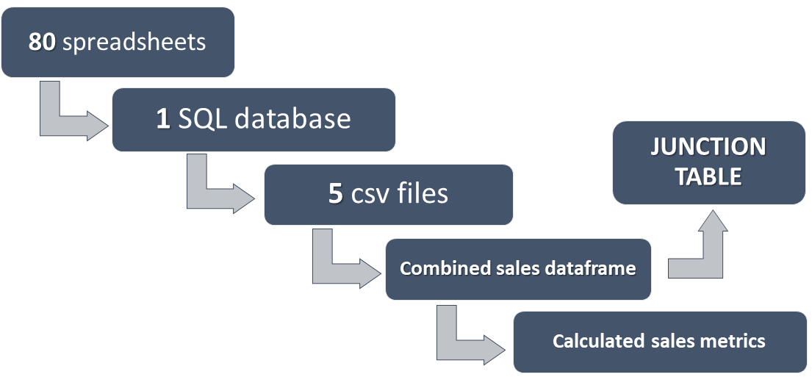
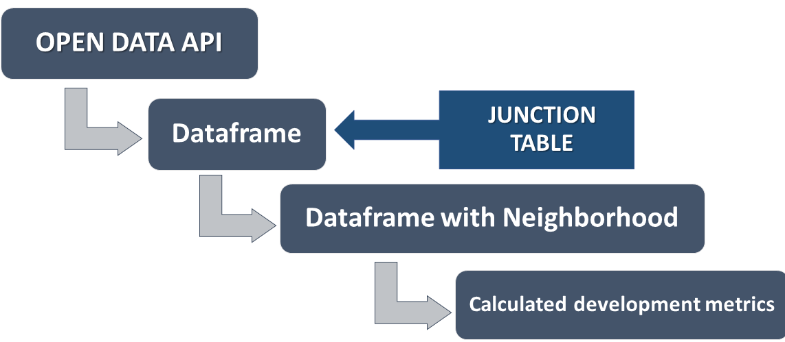
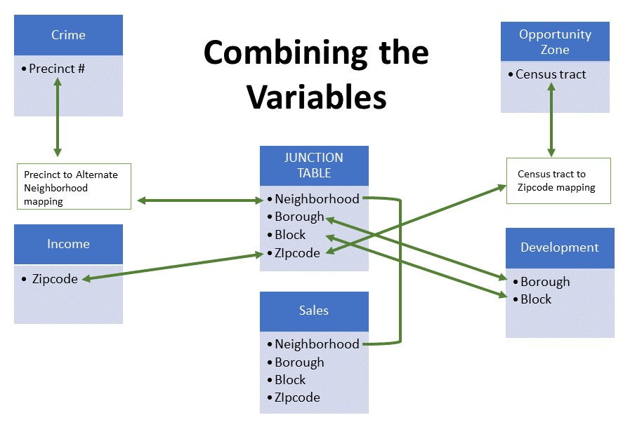

# NYC Neighborhood Transformation and Development
### JC Soliman, Emmy Kuo & Michana Pubien 

The New York City real estate market is an immensely complex environment that is constantly changing and developing. Predicting the next up & coming neighborhood could mean turning a huge profit, while a small misstep could mean huge losses. 

With the passing of an increased 'Mansion Tax', activity in the condo market has slowed. Additionally, the passing of the "Housing Stability & Tenant Protections Act" this past June has not only subjected rent stabilized multifamily properties to increased regulatory burdens, but also effectively disincentivized investment. Multifamily properties that are not subject to rent stabilization have also been affected by the law. 

Activity in Manhattan experienced the lowest third quarter sales since 2009, reported Corcoran. The median sale price fell by 8% while the mean sale price fell by 12%. It has become increasingly necessary to look to other boroughs and neighborhoods for development opportunities.


## **Our Approach**

Before making any predictions or recommendations, we first constructed an accurate snapshot of NYC neighborhoods and explored the growth trends in those neighborhoods. Then we developed a criteria to rank the neighborhoods by how suitable they are for investment. Finally, we looked at how well the models coincided with indicators in current policy.

## **What factors are important?**

We decided to look at three main factors that make up a neighborhood: people, place and policy. Based on relative importance and the availability of data, we chose the following variables to study.

**People** 
* Income data (IRS)
* Crime data (NYPD)

**Place** 
* Sales Data (NYC Department of Finance)
* Development data (NYC Department of Buildings)

**Policy** 
* Opportunity Zones (NYC Empire State Development)
---

## **The Data**


### **Crime Data**
\
NYC crime data was obtained from the [NYPD website]() for 2000 - 2018. The entire period of data came as one spreadsheet, and had to be normalized. Additionally, the data was indexed by Precinct number, and not neighborhood.


### **Income Data**
\
Income tax returns data was obtained directly from the [IRS](https://www.irs.gov/statistics/soi-tax-stats-individual-income-tax-statistics-2016-zip-code-data-soi) for 2003-2016. The data came in 14 separate spreadsheets, one per year, with each year in a different format. The income tax data was indexed by zipcode.

### **Sales Data**
\
Sales data was obtained from the [NYC Department of Finance website](https://www1.nyc.gov/site/finance/taxes/property-annualized-sales-update.page) for years 2003 to 2018. The data was available as 80 separate excel files, one per borough per year. 

First, the 80 spreadsheets were converted to csv files using Microsoft Excel. Then each file was loaded into pgAdmin, where the data was was concatenated by borough through the years, resulting in 5 csv file exports. The per borough csv files were loaded into Jupyter Lab and converted to 1 dataframe. (Staten Island was later excluded due to a lack of crime data, so only 4 boroughs were combined.) 

A junction table was created from the combined dataframe since the sales data already included neighborhoods as a field. The junction table included neighborhood, zipcode, borough and block number. 

After the junction table was exported, the dataframe was then used to calculate metrics and the calculated metrics were exported as a csv to be used in the Joint Analysis.



### **Development Data**
\
Development data was obtained from NYC OPEN DATA. The dataset used was the [DOB Job Filing dataset](https://data.cityofnewyork.us/Housing-Development/DOB-Job-Application-Filings/ic3t-wcy2) that covered 2000-2019. The data was available by API through Socrata. 

The [sodapy SDK](https://github.com/xmunoz/sodapy) was installed as a Python library to used to access the API. The following SoQl query was used to get information from the API. Note that the 'limit' field had to be specified since the default get only retrieved 1000 rows of data. 
```
query = "select Borough, Block, Lot, Pre__Filing_Date, Initial_Cost limit 1700421"
```
The data was converted into a dataframe. Since the datatypes from the API were all 'objects', the 'Block' column had to be converted to 'integer' in order to be compatible for a merge. 

In order to add 'Neighborhood' to the dataframe, the JUNCTION TABLE dataframe was joined using both 'Borough' and 'Block'. Metrics for development were then calculated and exported via csv to be used in Joint Analysis.



### **Opportunity Zone Data**
\
Opportunity Zone information was obtained from the [NYS Empire Development website](https://esd.ny.gov/opportunity-zones). It came in a PDF format where each zone was identified by a census tract number. 

---

## **How did we combine the selected variables?**

Each of the 5 datasets was obtained from a different governement entity. They came in different file formats, were organized differently, used different indices, included different identifying information and often had different formats throughout the years.

Since the objective was to study the neighborhoods, we created a junction table to merge with each dataset so that each variable's dataset could include a 'neighborhood' column. Each entry in the sales data included a pre-categorized neighborhood, BBL (borough, block, lot) and zipcode, so we used the sales data to create a junction table. 



Crime data and Opportunity Zone did not include any of the fields in the junction table. For Opportunity Zones, the census tract had to be mapped to zipcodes and then combined with the junction table. 

Crime data had to be mapped to an alternate neighborhoods list. Then the list had to be manually mapped to the Neighborhood field in junction table. 

---

## **Our Current Snapshot**

---

## **How did we evaluate growth?**
