# NYC Neighborhood Transformation and Development
### JC Soliman, Emmy Kuo & Michana Pubien 

The New York City real estate market is an immensely complex environment that is constantly changing and developing. Predicting the next up & coming neighborhood could mean turning a huge profit, while a small misstep could mean huge losses. 

With the passing of an increased 'Mansion Tax', activity in the condo market has slowed. Additionally, the passing of the "Housing Stability & Tenant Protections Act" this past June has not only subjected rent stabilized multifamily properties to increased regulatory burdens, but also effectively disincentivized investment. Multifamily properties that are not subject to rent stabilization have also been affected by the law. 

Activity in Manhattan experienced the lowest third quarter sales since 2009, reported Corcoran. The median sale price fell by 8% while the mean sale price fell by 12%. It has become increasingly necessary to look to other boroughs and neighborhoods for development opportunities.


## **Our Approach**

Before making any predictions or recommendations, we first constructed an accurate snapshot of NYC neighborhoods and explored the growth trends in those neighborhoods. Then we developed a criteria to rank the neighborhoods by how suitable they are for investment. Finally, we looked at how well the models coincided with indicators in current policy.

## **What factors are important?**

We decided to look at three main factors that make up a neighborhood: people, place and policy. Based on relative importance and the availability of data, we chose the following variables to study.

**People** 
* Income data (IRS)
* Crime data (NYPD)

**Place** 
* Sales Data (NYC Department of Finance)
* Development data (NYC Department of Buildings)

**Policy** 
* Opportunity Zones (NYC Empire State Development)
---

## **The Data**

Each of the 5 datasets was obtained from a different governement entity. They came in different file formats, were organized differently, used different indices, included different identifying information and often had different formats throughout the years. We used the following technologies to tame our data.

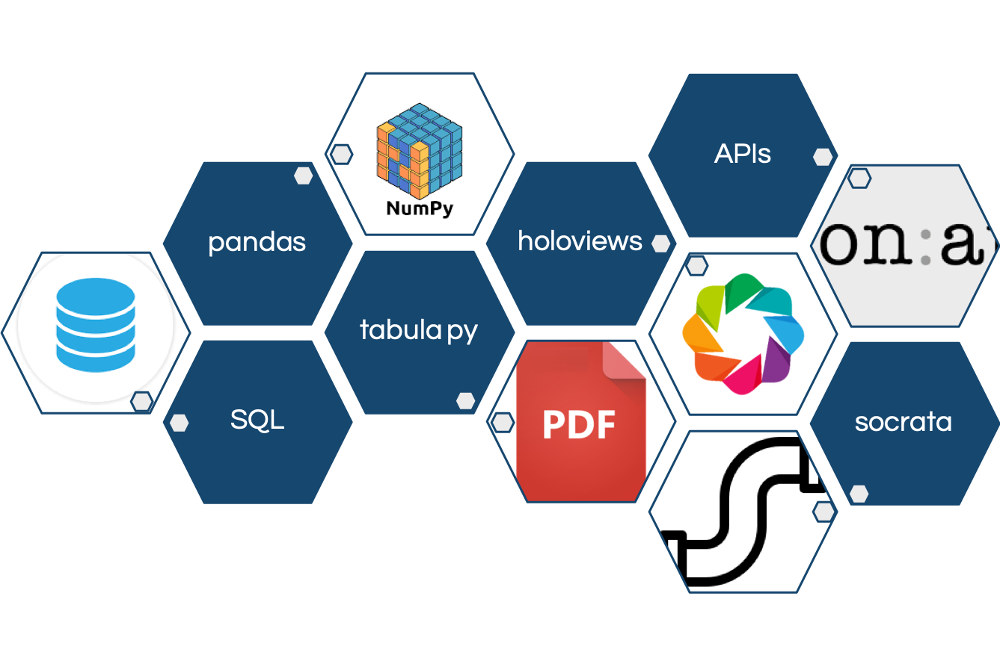

---

### **Crime Data**
\
NYC crime data was obtained from the [NYPD website]() for 2000 - 2018. The entire period of data came as one spreadsheet, and had to be normalized. Additionally, the data was indexed by Precinct number, and not neighborhood.

We were able to find a neighborhood to Precinct mapping but that came in an image format.  We first converted the image to CSV then used that mapping to merge into the original crime data.
Next, I was able to stack the data by year using the melt function.  That allowed for us to sort the data by year in a new column.
The last step was to create a new dataframe to sync my file to the junction table, which took quite a bit of manipulation to come to a final crime data file for our analysis.

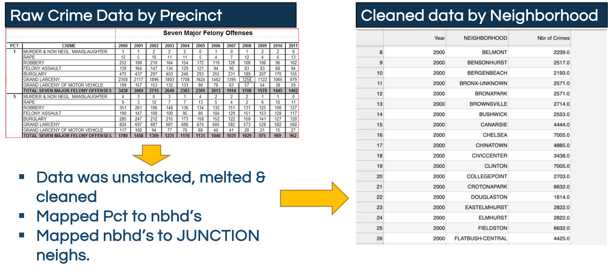\

---
### **Income Data**
\
Income tax returns data was obtained directly from the [IRS](https://www.irs.gov/statistics/soi-tax-stats-individual-income-tax-statistics-2016-zip-code-data-soi) for 2003-2016. The data came in 13 separate spreadsheets, one per year, with each year in a different structure, with ZIP code as the closest identifier to neighborhood. 

Key to cleaning up the income data is first understanding the level of inconsistency across all spreadsheets, and then finding a singular approach, i.e a function, to produce one consolidated data frame. The processes embedded in the function include:
* reading the filenames that came in different naming conventions
* ensuring all spreadsheets had all the information required for our analysis
* selecting those columns and aligning them in the right order
* renaming the columns to allow for efficient concatenation
* dropping unwanted rows
* finding nuanced representations of zeroes and replacing them with zeroes
* dropping the nulls
* converting the columns to appropriate data types
* calculating the mean values

Calling this function with year as input in a concatenation command allowed for efficient processing of the data frame. The data frame was then merged with a junction table that had both zip andto enhance it with a neighborhood column. The resulting data frame was then used to produced the metrics by neighborhood.

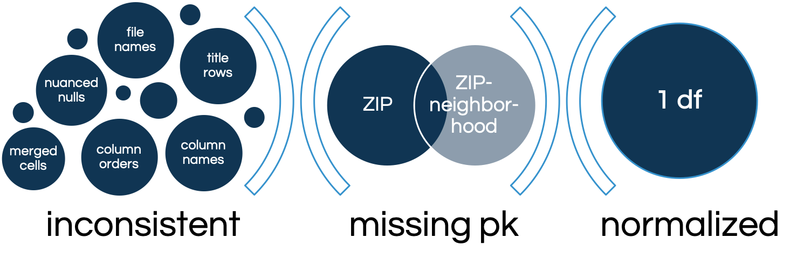


---

### **Sales Data**
\
Sales data was obtained from the [NYC Department of Finance website](https://www1.nyc.gov/site/finance/taxes/property-annualized-sales-update.page) for years 2003 to 2018. The data was available as 80 separate excel files, one per borough per year. 

First, the 80 spreadsheets were converted to csv files using Microsoft Excel. Then each file was loaded into pgAdmin, where the data was was concatenated by borough through the years, resulting in 5 csv file exports. The per borough csv files were loaded into Jupyter Lab and converted to 1 dataframe. (Staten Island was later excluded due to a lack of crime data, so only 4 boroughs were combined.) 

A junction table was created from the combined dataframe since the sales data already included neighborhoods as a field. The junction table included neighborhood, zipcode, borough and block number. 

After the junction table was exported, the dataframe was then used to calculate metrics and the calculated metrics were exported as a csv to be used in the Joint Analysis.


---

### **Development Data**
\
Development data was obtained from NYC OPEN DATA. The dataset used was the [DOB Job Filing dataset](https://data.cityofnewyork.us/Housing-Development/DOB-Job-Application-Filings/ic3t-wcy2) that covered 2000-2019. The data was available by API through Socrata. 

The [sodapy SDK](https://github.com/xmunoz/sodapy) was installed as a Python library to used to access the API. The following SoQl query was used to get information from the API. Note that the 'limit' field had to be specified since the default get only retrieved 1000 rows of data. 
```
query = "select Borough, Block, Lot, Pre__Filing_Date, Initial_Cost limit 1700421"
```
The data was converted into a dataframe. Since the datatypes from the API were all 'objects', the 'Block' column had to be converted to 'integer' in order to be compatible for a merge. 

In order to add 'Neighborhood' to the dataframe, the JUNCTION TABLE dataframe was joined using both 'Borough' and 'Block'. Metrics for development were then calculated and exported via csv to be used in Joint Analysis.


---

### **Opportunity Zone Data**
\
Opportunity Zone information was obtained from the [NYS Empire Development website](https://esd.ny.gov/opportunity-zones). It came in a PDF format where each zone was identified by a census tract number and neighborhood names.

The tabula py library, which required installation of Java Developer Kit, enabled us to read a pdf file and convert it to a dataframe. Similar to the crime data, this neighborhood column did not align with the rest of the datasets' neighborhood index. A manual mapping had to be built in the backend to ensure consistency.


---

## **Combining the Variables**

Since the objective was to study the neighborhoods, we created a junction table to merge with each dataset so that each variable's dataset could include a 'neighborhood' column. Each entry in the sales data included a pre-categorized neighborhood, BBL (borough, block, lot) and zipcode, so we used the sales data to create a junction table. 


Crime data and Opportunity Zone did not include any of the fields in the junction table. For Opportunity Zones, the census tract had to be mapped to zipcodes and then combined with the junction table. 

Crime data had to be mapped to an alternate neighborhoods list. Then the list had to be manually mapped to the Neighborhood field in junction table. 

---
## **Calculating Aggregate Scores**
Each neighborhood was ranked in terms of their latest crime rate (lowest crime rate -> highest value), latest income (highest income -> highest value), average sales (highest average -> highest value) and cumulative development spending (highest cume -> highest value).

### **Equal Weights to All Variables**
An aggregate neighborhood score was calculated using the following equation where each variable's ranking was given the same weight.

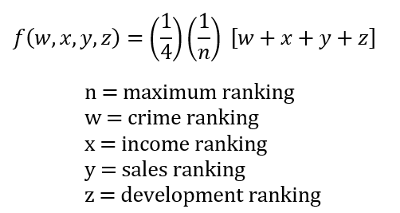

### **Weighting Variables by Data Completeness**
The number of years covered by the data available for each variable were different for each variable.

* Crime: 18 years
* Income: 13 years
* Sales: 16 years
* Development: 19 Years

The equation below weights each variable based on the relative completeness of data across the years. 

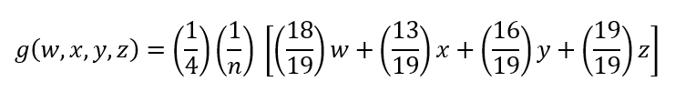

### **Weighting Variables by Data Loss during Data Cleaning**
The data did not come in the same format, so many transformations and mappings of data had to be made to get all the variables on the same neighborhood index. Techniques to approximate and fill dataframes and approximate mappings of data were made. The equation below includes weights assigned by the data cleaner based on the data cleaner's take of data reliability & data loss. 

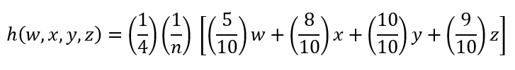

* **Sales** - Since the sales data was used to create the junction table, a score of **10/10** was assigned to the sales variable. 
* **Development** - Development data was identified by block and borough, which was also in the sales junction table. However, there was no proof that the list of borough and block on the junction table was exhaustive. There were several unmapped datapoints, so a score of **9/10** was assigned. 
* **Income** - Income data was available by zipcode and was an exhaustive list. The zipcode to neighborhood mapping was many to many, so arithmetic means were used to determine the income by neighborhood. A score of **8/10** was assigned.
* **Crime** -  The data was originally available per precinct. A non-exhaustive mapping of precinct to neighborhood was used to map to neighborhood. However, that list of neighborhoods only contained ~100 neighborhoods. A manual mapping of that neighborhood list had to be performed to the junction table neighborhood list, which had ~200 neighborhoods. Therefore, a score of **5/10** was assigned to the crime data.  

## **Our Current Snapshot**

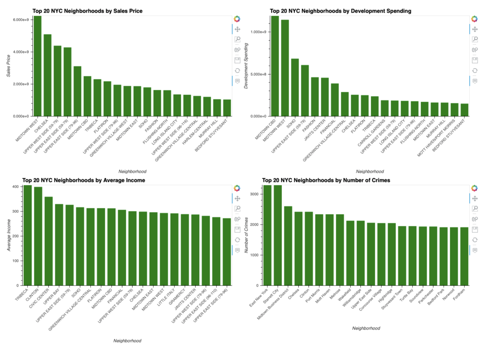

As expected, our model consistently found neighborhoods that are historically well developed. The top ten current neighborhoods are below.

* Midtown West
* Upper West Side (59-79)
* Midtown East
* Murray Hill
* Upper West Side (79-96)
* Kips Bay
* Gramercy
* Harlem Central
* Parkslope
* Long Island City

However, Chelsea, Midtown Central Business District & Flatiron, which we expected to see in the top ten, fell to the high twenties due to their relatively high crime rates. For further analysis, crime data should take into account population density. It should be noted that based on the third calcualtion method, which lowers the weight of crime rank, Midtown CBD, Flatiron and Chelsea ranked 13, 17 & 18 respectively.


---

## **How did we evaluate growth?**

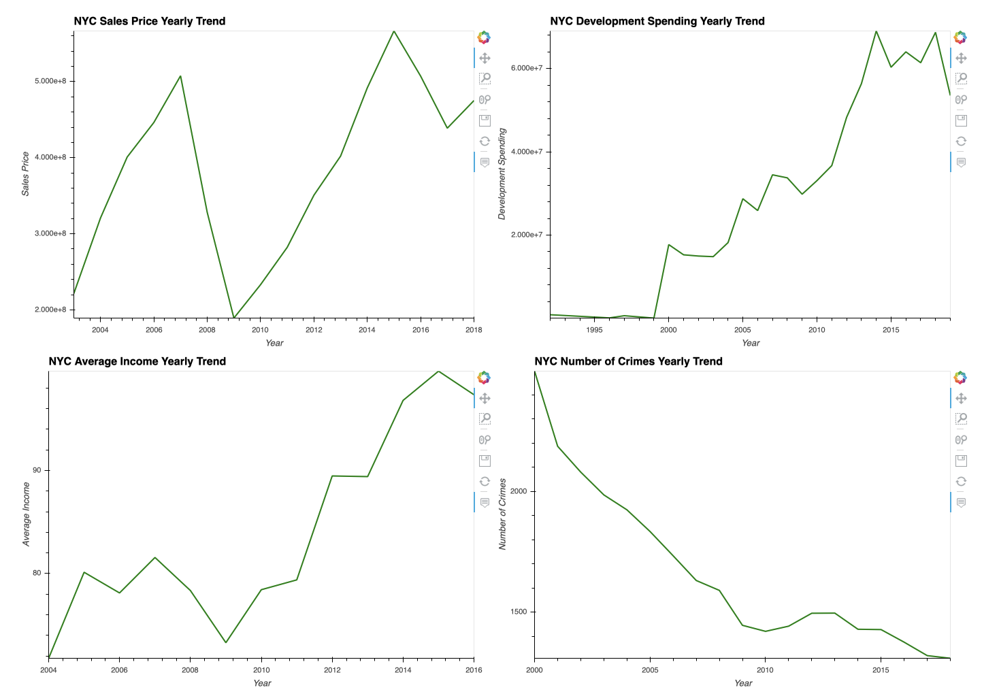

The average rate of change for the entire period of the dataset was calculated for each variable. Additionally, we calculated the average rate of change for the last 3 years and the last 5 years per neighborhood. The difference between the 3 year ROC, 5 year ROC and average ROC were calculated as well. 

We used the comparison between the 3 year ROC and the average ROC as the primary basis for investment recommendation. Additionally, we incorporated opportunity zones into our model. The equations including the binary opportunity zone variable are below.

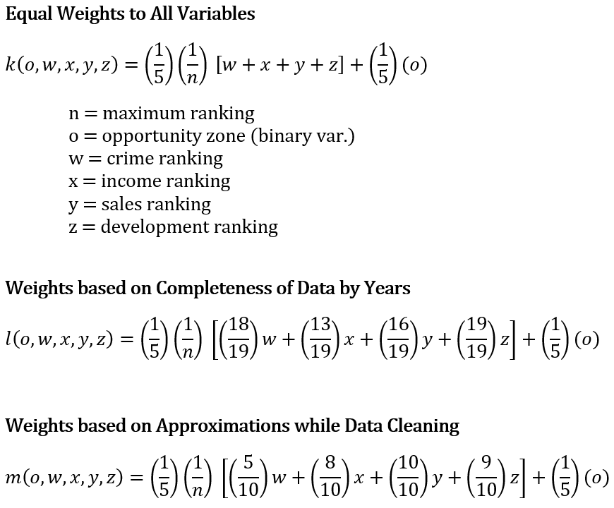

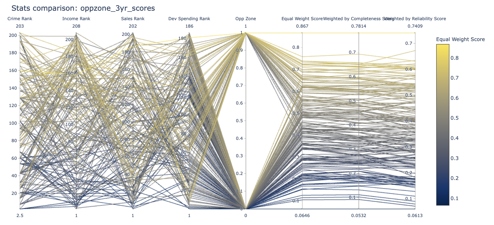

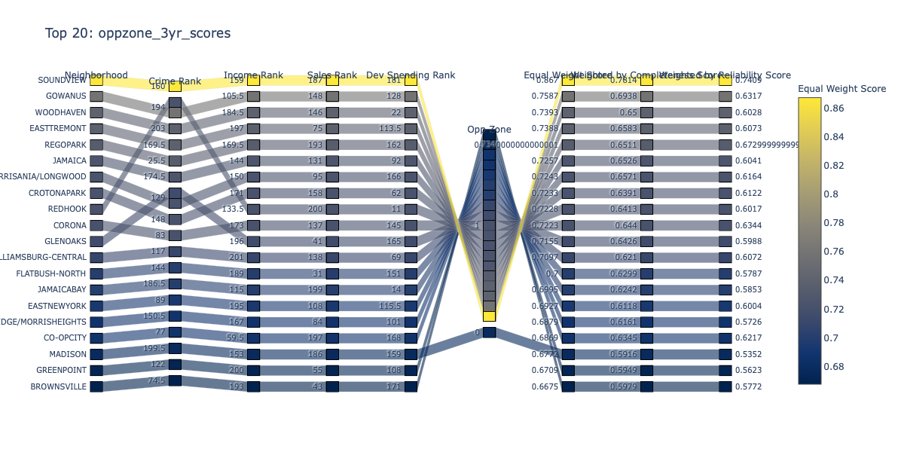

Based on this method of analysis, the following ten neighborhoods were identified as suitable for investment, especially for investors who are looking to defer capital gains across asset classes (not exclusive to real estate capital gains). 

* Soundview
* Gowanuns
* Woodhaven
* East Tremont
* Rego Park
* Jamaica
* Longwood
* Crotona Park
* Redhook
* Corona

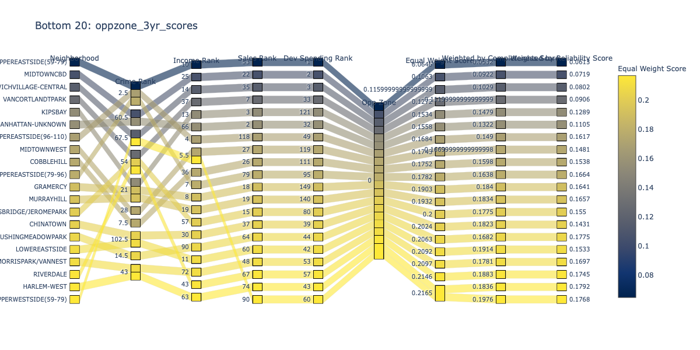

## **Our Recommendations**

The methodology used in calculating the investment worthiness of a neighborhood in this project has limitations. Our next steps to further mature the model include:
* employ more accurate estimation methodologies such as linear regression
* use research-based weighting of variables
* explore more sources of data


